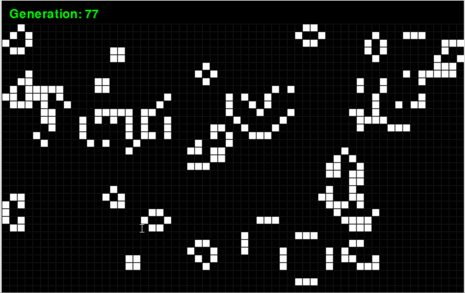

# Game of Life

According to Wikipedia's article: "The Game of Life, also known simply as Life, is a cellular automaton devised by the British mathematician John Horton Conway in 1970."

The board is made up of an m x n grid of cells, where each cell has an initial state: live (represented by a 1 or a white cell) or dead (represented by a 0 or a black cell). Each cell interacts with its eight neighbors (horizontal, vertical, diagonal) using the following four rules (taken from the above Wikipedia article):

- Any live cell with fewer than two live neighbors dies as if caused by under-population.
- Any live cell with two or three live neighbors lives on to the next generation.
- Any live cell with more than three live neighbors dies, as if by over-population.
- Any dead cell with exactly three live neighbors becomes a live cell, as if by reproduction.

A GUI using Pygame has been created to visually illustrate how this process is actually working through several generations.

    

